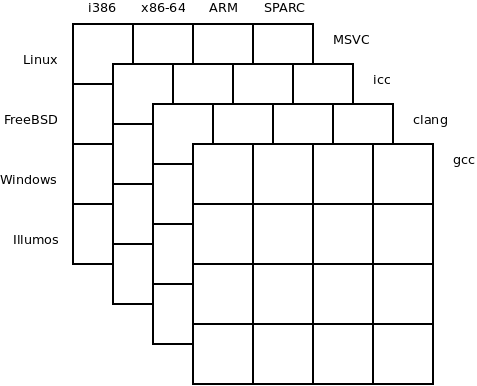

# Cartesian - generator for complex configurations

There's a specific subset of problems in IT industry that have big and somewhat regular domains, but not fully so.

Consider the task of configuring a test suite. You have a fleet of different boxes, with different processors, different operating systems, different compilers, you want to run different tests and do so with different compile-time and run-time options.

In theory, the test suite would be a perfectly regular N-dimensional matrix featuring all the dimensions mentioned above. But that's where the complexity kicks in: Oh! MSVC only works on Windows! Test X requires 8G of memory and the box Y only has 4G available. Shared libraries have .so extension on Linux, .dll extension on Windows and .dylib extension on OSX. I need to switch on valgrind for test X an box Y temporarily to debug a problem. Support for SPARC in our preferred version of LLVM doesn't quite work yet. We need to use older version of LLVM on SPARC plarforms. And so on and so on.

Trying to address this complexity by hand results in a big mess. Trying to address it via inheritance hieratchy doesn't work well either: Different dimensions don't aggregate in classic inheritance hierarchies, rather, they are composed in each-with-each combinatorial manner.



Cartesian is a simple Node module that generates such multidimensional configurations. It does so by allowing to define JavaScript objects with "alternative" properties. An alternative property can have multiple values. Such objects can then be expanded to an array of plain objects, a cartesian product of all the alternative properties:

```javascript
var c = require('./cartesian.js')

var obj = {
    a: 0,
    b: c.alt(1, 2),
    c: c.alt('A', 'B')
}

console.log(c.expand(obj))
```

The output looks like this:

```
[ { a: 0, b: 1, c: 'A' },
  { a: 0, b: 1, c: 'B' },
  { a: 0, b: 2, c: 'A' },
  { a: 0, b: 2, c: 'B' } ]
```

Let's now try to define a real-world configuration for a test suite. We can start by describing the boxes we have in our machine fleet:

```javascript
var box1 = {
    hostname: 'box1',
    os: 'linux',
    arch: 'x86-64',
    ram: 8,
}

var box2 = {
    hostname: 'box2',
    os: 'freebsd',
    arch: 'arm',
    ram: 16,
}

var box3 = {
    hostname: 'box3',
    os: 'windows',
    arch: 'x86-64',
    ram: 4,
}

var box4 = {
    hostname: 'box4',
    os: 'illumos',
    arch: 'sparc',
    ram: 4,
}
```

Here's the definition of the compilers:

```javascript
var gcc = {
    binary: 'gcc',
    version: '4.8.4',
}

var clang = {
    binary: 'clang',
    version: '3.4.1',
}

var msvc = {
    binary: 'cl.exe',
    version: '15.00.30729.01',
}
```

And finally, definitions of individual tests:

```javascript
var frobnicate = {
    binary: 'frobnicate',
    sources: 'frobnicate.c'
}

var loadtest = {
    binary: 'loadtest',
    sources: 'loadtest.c helper.c'
}

var end2end = {
    binary: 'end2end',
    sources: 'end2end.c helper.c'
}
```

Now we can combine all these dimensions into a single configuration:

```javascript
var testsuite = {
    box: c.alt(box1, box2, box3, box4),
    compiler: c.alt(gcc, clang, msvc),
    test: c.alt(frobnicate, loadtest, end2end),
}

var config = c.expand(testsuite)
console.log(JSON.stringify(c.expand(config), null, '  '))
```

The result is cartesian product of all the boxes, compilers and tests. There's a lot of results, so let's have a look only at the first and the laster one:

```
[
  {
    "box": {
      "hostname": "box1",
      "os": "linux",
      "arch": "x86-64",
      "ram": 8
    },
    "compiler": {
      "binary": "gcc",
      "version": "4.8.4"
    },
    "test": {
      "binary": "frobnicate",
      "sources": "frobnicate.c"
    }
  },

  ...

  {
    "box": {
      "hostname": "box4",
      "os": "illumos",
      "arch": "sparc",
      "ram": 4
    },
    "compiler": {
      "binary": "cl.exe",
      "version": "15.00.30729.01"
    },
    "test": {
      "binary": "end2end",
      "sources": "end2end.c helper.c"
    }
  }
]
```

One important thing to realize is that we can calculate new properties using classic JavaScript getter syntax. We may, for example, want a property that would contain the command line to run the test:

```javascript
var testsuite = {
    box: c.alt(box1, box2, box3, box4),
    compiler: c.alt(gcc, clang, msvc),
    test: c.alt(frobnicate, loadtest, end2end),
    get cmdline() {
        return this.compiler.binary + ' ' + this.test.sources + ' -o ' + this.test.binary
    }
}
```

The resulting configuration objects look like this:

```
{
  "box": {
    "hostname": "box1",
    "os": "linux",
    "arch": "x86-64",
    "ram": 8
  },
  "compiler": {
    "binary": "gcc",
    "version": "4.8.4"
  },
  "test": {
    "binary": "loadtest",
    "sources": "loadtest.c helper.c"
  },
  "cmdline": "gcc loadtest.c helper.c -o loadtest"
}
```

But wait! MSVC doesn't recognize -o option. We should use /Fe option instead. Let's do it be defining the option name in the compiler object:

```javascript
var gcc = {
    binary: 'gcc',
    version: '4.8.4',
    output_option: '-o',
}

var clang = {
    binary: 'clang',
    version: '3.4.1',
    output_option: '-o',
}

var msvc = {
    binary: 'cl.exe',
    version: '15.00.30729.01',
    output_option: '/Fe',
}

...

var testsuite = {
    box: c.alt(box1, box2, box3, box4),
    compiler: c.alt(gcc, clang, msvc),
    test: c.alt(frobnicate, loadtest, end2end),
    get cmdline() {
        return this.compiler.binary + ' ' + this.test.sources + ' ' +
            this.compiler.output_option + ' ' + this.test.binary
    }
}
```

Assuming that we will be adding more option names to compiler objects later on, it will be probably better to use a bit of inheritance and have all the options that are same for gcc and clang in the base class and overload them only for MSVC. This can be done using classic JavaScript inheritance:

```javascript
var compiler = {
    output_option: '-o',
}

var gcc = {
    binary: 'gcc',
    version: '4.8.4',
}
gcc.__proto__ = compiler

var clang = {
    binary: 'clang',
    version: '3.4.1',
}
clang.__proto__ = compiler

var msvc = {
    binary: 'cl.exe',
    version: '15.00.30729.01',
    output_option: '/Fe',
}
msvc.__proto__ = compiler
```

But wait a second. MSVC works only on Windows. How are we supposed to get rid of the unwanted configations for MSVC-bases tests on non-Window platforms? To do this kind of stuff, Cartesian recognizes special object property called 'is'. If it evaluates to true the object will make it into the result. It it evaluates to false the object will be discarded:

```javascript
var testsuite = {

    ...

    get is() {
        if(this.compiler.binary == 'cl.exe' && this.box.os != 'windows') return false
        return true
    }
}
```

And that's all, folks. Cartesian can be used to produce for tests in a test suite, bunch of processes running on a machine, bunch of machines running in a clster and so on. Enjoy!

